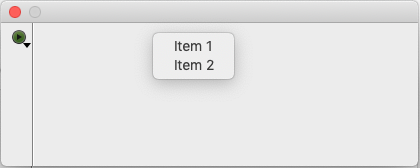

# ToolBarPopupMenu
Omnis Studio library to demonstrate the communication between a popup menu opened from a toolbar button and a Window class

# Classes
| Class | Description |
|-------|-------------|
| NewWindow | Window class containing the Toolbar with a toolbar component NewToolbar |
| NewToolbar | Toolbar class which opens the menu NewMenu
| NewMenu | Menu class which openened from class NewWindow |

# How does it work?
After opening the window NewWindow you can click the toolbar button.

Clicking this button give a menu with one item.

Choosing this item a new menu is opened with two items.

Choosing one of these items opens a OK message with as title the 
clicked item of the last menu and in the text of the message the menuitem of the first menu. 

The `OK Message` command is located in the method NewWindow.$toolbarDispatch. Which receives the $text of the first 
menu as a parameter.
